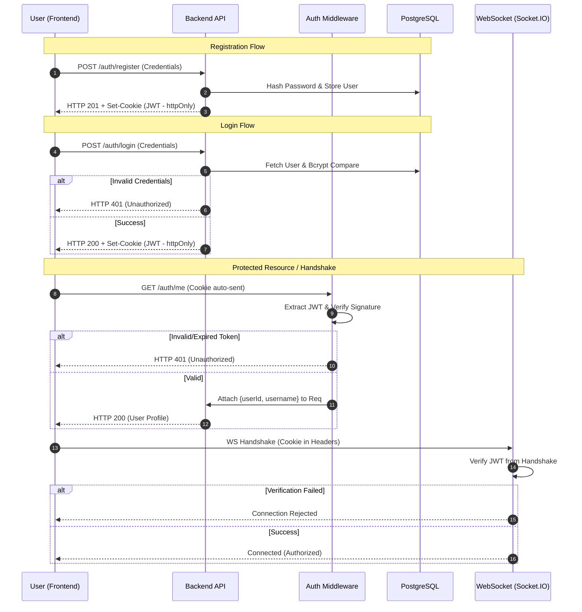

# SocketChat Authentication Architecture

This project implements a secure, scalable, and modern authentication system using the **C-S-A (Cookie-Session-Auth)** pattern.

## 1. Auth Flow Diagram

## 2. Technical Implementation Details

### A. JWT Payload Structure
The system uses a compact JWT payload to minimize cookie size while providing sufficient context for the backend:
- `userId`: UUID of the user (used for database lookups).
- `username`: Current display name (used for real-time message attribution).
- `email`: User's unique identifier.

### B. Security Design Choices
- **HttpOnly Cookies**: Prevents client-side scripts from accessing the token, providing robust protection against **XSS**.
- **SameSite: Lax**: Ensures session cookies are sent during safe, top-level navigations but blocked for cross-site sub-requests (CSRF protection).
- **Secure Flag**: Enabled in production to ensure tokens are only transmitted over HTTPS.

### C. The Middleware Layer
Authentication is decentralized into a reusable **Auth Middleware**:
1. **Extraction**: Reads `token` from `req.cookies`.
2. **Validation**: Uses `jwt.verify()` with a secure environment secret.
3. **Hydration**: Attaches the decoded user data to `req.user` (Express) or `socket.user` (Socket.IO).
4. **Failure Handling**: Explicitly returns `401 Unauthorized` for missing, expired, or malformed tokens.

### D. WebSocket Handshake Authorization
Unlike standard APIs, WebSockets are authorized during the initial **HTTP upgrade (Handshake)**. 
- The browser automatically includes the HttpOnly cookie in the handshake headers.
- The server interceptor validates the cookie *before* the socket moves to the `connected` state.
- This prevents "ghost" connections from unauthorized clients, saving server resources.

## 3. Endpoints Matrix
| Method | Endpoint | Auth | Description | Failure Path |
| :--- | :--- | :--- | :--- | :--- |
| POST | `/api/auth/register` | No | Creates new account & sets cookie | 400 (Validation/Conflict) |
| POST | `/api/auth/login` | No | Verifies credentials & sets cookie | 401 (Invalid Credentials) |
| POST | `/api/auth/logout` | Yes | Clears the session cookie | 401 (Session Expired) |
| GET | `/api/auth/me` | Yes | Returns identity of current session | 401 (No Token/Invalid) |
| POST | `/api/upload/upload`| Yes | Secure file upload to server | 401 (Unauthorized) |
