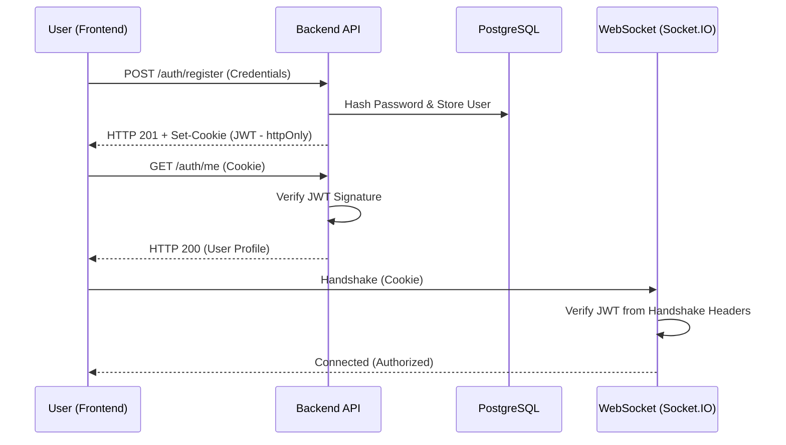

# SocketChat Authentication Architecture

This project implements a secure, scalable, and modern authentication system using the **C-S-A (Cookie-Session-Auth)** pattern.

## 1. Auth Flow Diagram

## 2. Tech Stack
- **Database**: PostgreSQL (User persistence)
- **Hashing**: Bcryptjs (Password encryption)
- **Tokenization**: JSON Web Token (JWT)
- **Transport**: HttpOnly Cookies (Secure session management)

## 2. The Flow

### A. Registration
1. Frontend sends `username`, `email`, and `password` via `POST /api/auth/register`.
2. Backend validates data, hashes the password using **Bcrypt**, and saves the user to PostgreSQL.
3. A JWT is signed (containing `userId` and `username`) and attached to the response via a `Set-Cookie` header.

### B. Login
1. Frontend sends credentials.
2. Backend verifies the email exists and compares the hashed password.
3. On success, a new JWT is issued and stored in an **HttpOnly cookie**.

### C. Session Persistence & Protection
- **Backend Middleware**: Every request to a protected route passes through `authMiddleware`. It reads the cookie, verifies the JWT signature, and attaches the user object to the request.
- **Frontend AuthContext**: On initial load, the React app calls `/api/auth/me`. If a valid cookie exists, the user is logged in automatically. If not, they are redirected to `/login`.

## 3. Security Design Choices
- **Credential Inclusion**: All `fetch` calls use `credentials: 'include'` to ensure the browser sends the session cookie during cross-origin requests.
- **XSS Prevention**: By using `httpOnly`, the JWT cannot be stolen via malicious scripts.
- **CSRF Mitigation**: Uses `SameSite: Lax` to ensure cookies are only sent during safe, top-level navigations.

## 4. Endpoints
| Method | Endpoint | Description |
| :--- | :--- | :--- |
| POST | `/api/auth/register` | Create a new account |
| POST | `/api/auth/login` | Authenticate and set cookie |
| POST | `/api/auth/logout` | Clear the session cookie |
| GET | `/api/auth/me` | Return current user data (Verified) |
