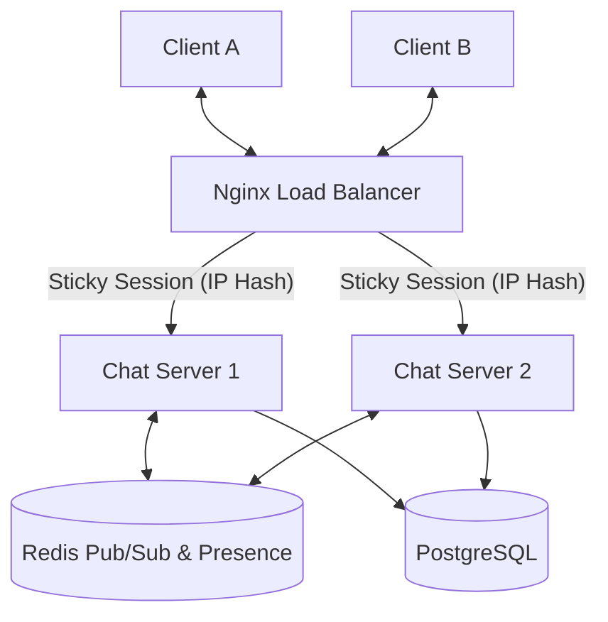

# SocketChat: Distributed Real-Time Messaging System

SocketChat is a production-grade, distributed real-time chat system designed as a technical case study in **System Design**. It demonstrates how to build a scalable messaging platform that handles persistent connections, synchronized state, and high availability.

---

## 🏗 System Architecture

The project implements a distributed architecture to allow horizontal scaling across multiple backend instances.

### 🗝 Key Architectural Layers

#### 1. Real-Time Communication (WebSockets)
*   **Socket.IO**: Used for low-latency, bi-directional communication.
*   **Sticky Sessions**: Implemented via Nginx `ip_hash` to ensure the HTTP handshake and WebSocket upgrade happen on the same physical server.
*   **Redis Adapter**: Bridges multiple backend instances. A message sent to Server A is published to Redis and broadcasted by Server B to its connected clients.

#### 2. Authentication & Security
*   **C-S-A Pattern**: (Cookie-Session-Auth). JWTs are stored in `httpOnly` cookies to mitigate XSS attacks.
*   **Handshake Authentication**: The WebSocket connection is authenticated during the initial HTTP upgrade by parsing the cookie header, preventing unauthorized socket connections.

#### 3. Message Reliability & Idempotency
*   **Write-Through Persistence**: Messages are persisted to PostgreSQL *before* being broadcasted to ensure durability.
*   **Idempotency**: Every message carries a `client_message_id` (UUID). The backend uses `INSERT ... ON CONFLICT DO NOTHING` to prevent duplicate messages during network retries.

#### 4. Distributed Presence Tracking
*   **Atomic Counters**: Uses Redis `HINCRBY` to track the number of active socket connections per user across the entire cluster.
*   **Multi-Tab Awareness**: Status only changes to `offline` when the global connection count for a user reaches zero, preventing "status flickering" during tab refreshes.

---

## 🚀 Technical Stack

*   **Frontend**: Next.js 15, Tailwind CSS, Lucide React, Socket.io-client.
*   **Backend**: Node.js, Express, TypeScript, Socket.io.
*   **Infrastructure**: 
    *   **PostgreSQL**: Persistent message and user storage.
    *   **Redis**: Distributed coordination, Pub/Sub, and presence state.
    *   **Nginx**: Reverse proxy and Load Balancer.

---

## 🚦 Sequence Flows

### Message Send Flow
1.  **Client**: Generates `client_message_id` and emits `message.send`.
2.  **Server**: Validates JWT session from handshake.
3.  **Database**: Attempts idempotent insert.
4.  **Redis**: Publishes message to the cluster.
5.  **Cluster**: All servers emit `message.new` to the relevant room.

### Presence Flow
1.  **Connect**: `HINCRBY presence:user_id 1`. If result is `1`, emit `user.status: online`.
2.  **Disconnect**: `HINCRBY presence:user_id -1`. If result is `0`, emit `user.status: offline`.

---

## 🛠 Strategic Trade-offs

*   **Redis Pub/Sub vs. Kafka**: Redis was chosen for its sub-millisecond latency for real-time fan-out, whereas Kafka would be preferred for long-term event sourcing and massive message replayability.
*   **IP Hash vs. Global Session**: `ip_hash` provides a simpler implementation for Socket.IO handshake affinity without needing a complex global session store for the initial upgrade.

---

## 📈 Future Scalability
*   **Sharding**: Partitioning the `messages` table by `channel_id` to handle Billions of rows.
*   **Global Presence**: Replacing the simple Redis Hash with Redis Sorted Sets for "Last Seen" timestamps.
*   **Offline Queuing**: Utilizing a task queue (like BullMQ) to handle push notifications when a recipient's connection count is zero.

---

## 💻 How to Run

1.  **Infrastructure**:
    `docker-compose up -d` (Starts Postgres & Redis)
2.  **Backend Instances**:
    `cd backend && npm run dev:1` (Port 4000)
    `cd backend && npm run dev:2` (Port 4001)
3.  **Frontend**:
    `cd frontend && npm run dev` (Port 3000)
4.  **Nginx**:
    Point Nginx to the provided `nginx.conf` and visit `localhost`.
